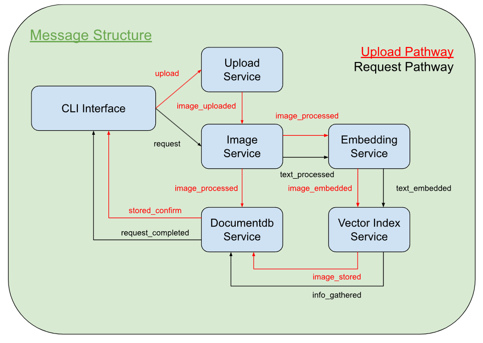

# Image Retrieval System
### Using natural language to lookup images based on the image's content

## Design

#### CLI-interface
- Controls if the user is trying to upload or request an image
- Listens to user input and update from the database service
- Listens if the query has been successful, print correct information (Channel: 'stored_confirm' for upload, 'request_completed' for request)
- Broadcasts the user input (Channels: 'upload' for upload, 'request' for requests)

#### Upload
- Converts image file into Base64 for storing into the database
- Listens to the file pathways (Channel: 'upload')
- Broadcasts the raw image content (Channel: 'image_uploaded')

#### Image Process
- Get objects from the image
- Listens to the incoming raw image content from the Upload (Channel: 'image_uploaded')
- Listens to incoming requests from CLI Interface (Channel: 'request')
- Broadcasts that the image information has been processed (this will be a couple of vertices/coordinates on the image along with a label saying all of the boxes the image has) (Channel: 'image_processed')
- Broadcasts that the request information has been processed (this will be text being converted by some AI process to be read by the embedding service properly) (Channel: 'text_processed')

#### Document DB Service
- Stores information relating to an image
- Listens to the Image Process and takes in the position information and labels, pairing it to the image (Channels: 'image_processed' for when image is processed, 'image_stored' for when image stored in vector index)
- Listens for request to gather info (Channel: 'info_gathered')
- Broadcasts that the content of the image has been saved (for the CLI Interface) (Channel: 'stored_confirm')
- Broadcasts the information from the vector index (Channel: 'request_completed')

#### Embedding Service
- Converts information into a vector space
- Listens for image content to be stored from Image Process (Channel: 'image_processed')
- Listens for user input asking to retrieve something (Channel: 'text_processed')
- Broadcasts that the content has been embedded (Channels: 'image_embedded' for upload, 'text_embedded' for request)

#### Vector Index Service
- Stores vector embedding
- Listens for the Embedding Service, asking for the vectorized information of an image (Channel: 'image_embedded')
- Listend for the Embedding Service, asking for the user input embedding to compare this embedding with existing ones (Channel: 'text_embedded')
- Broadcasts that the content has been saved (Channel: 'image_stored')
- Broadcasts information of vectors near the user input (Channel: 'info_gathered')

Why do pubsub?
- continue system when one stops working
- people can still request if upload stops working
- this makes the software extendable and async, allowing that new system to work when others are broken
- use only part of the system to allow other systems to do other things while it is not focused on the first query sent
- because of async, each service can run on its own CPU/GPU/OS (mac, windows, linux)
- 

1. message architecture
2. unit test by urself then with ai
3. code review with ai

Message Structure Options:
1. what is currently here (no DB)

Pros: 
- Everything you want is provided in the message
- Simpler Module (doesn't need to know what it is sending)

Cons: 
- No backup option in case the message is lost
- Bloated Message 

2. have no data related to the image, only id's, call to get more data from database (API)

Pros: 
- 

Cons:
- 

3. store in DB, no data (yes DB)

Pros: 
- Response/Results of the message is persistent?
- Split responsibility

Cons: 
- If other listeners use the databases at the same, this is a problem when requesting or uploading the database
- Multiple people being able to access the database is a security issue

redis.io
mongo
SW - software?
Mock-data

mongosh